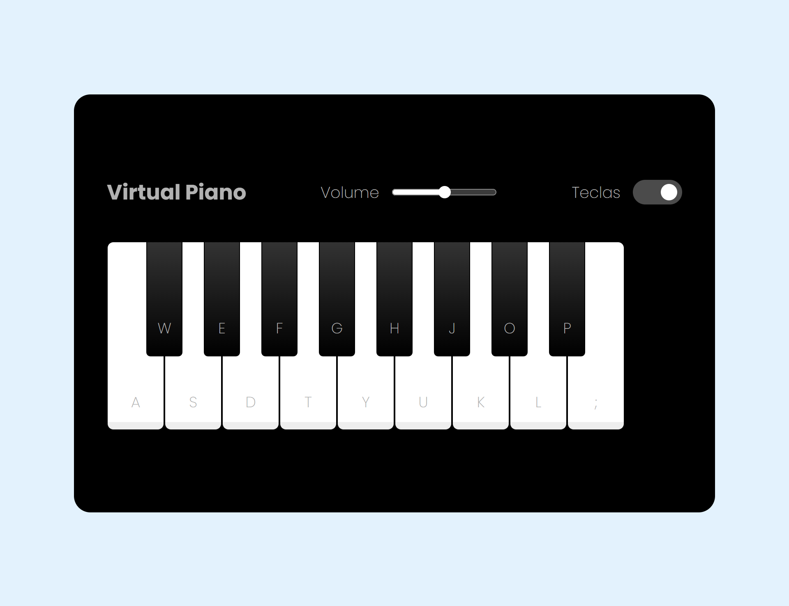

# Jogo: Simulador de Piano
### DIO - Bootcamp - PotenciaTech Ifood

Jogo desenvolvido no Bootcamp da DIO - PotenciaTech Ifood Desenvolvimento de jogos.

### Imagem do projeto

<!-- Repositório da aula
https://github.com/felipeAguiarCode/js-music-keyboard-virtual/tree/b75d713dd07255c58ad72430586658c2012443ad -->
